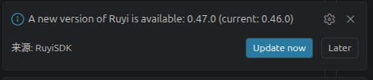
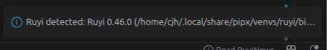

# 开启vscode时ruyi版本更新提示冲突

## 操作步骤
(弹窗需要再最新版vscode进行)
1. 以不同方法安装多个版本的 ruyi，并且在 VSCode 中的 ruyi 包管理器可以自由切换版本。

2. 以不同版本打开 Visual Studio Code。

## 预期结果
未安装最新版ruyi时会弹出新版本ruyi的更新提示，询问是否更新，已安装最新版ruyi时不再弹出版本更新提示。

## 测试结果
未安装最新版ruyi时会弹出新版本ruyi的更新提示，询问是否更新。

启动旧版本ruyi时，弹窗检测正常，且不再弹出更新提示

