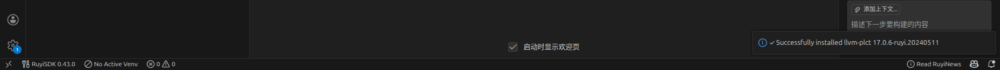
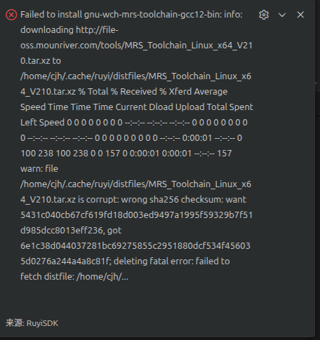
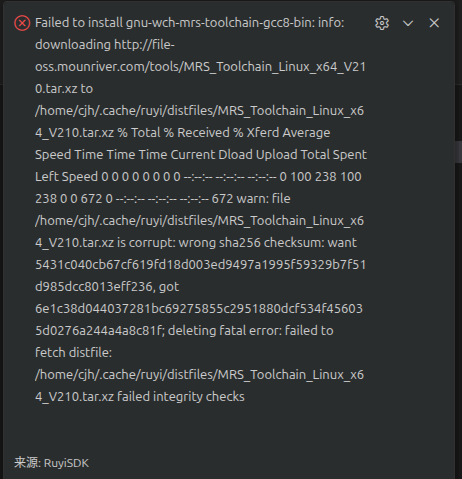
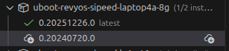
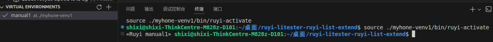
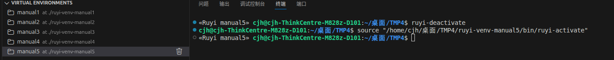
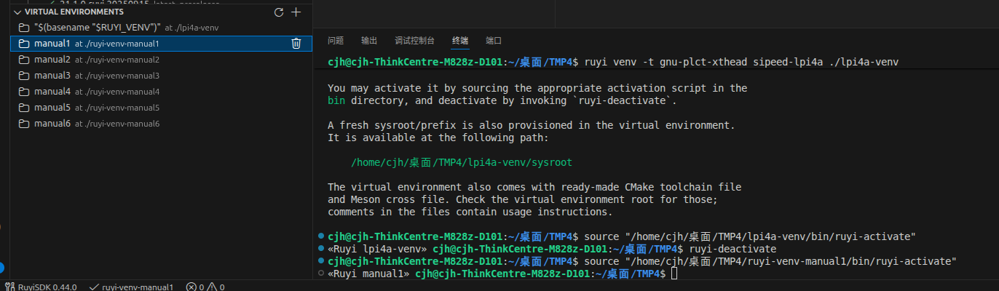

# **测试报告**

OS:Ubuntu 25.04

插件版本：[Ruyisdk-VScode-extension-0.1.0.vsix](https://github.com/ruyisdk/ruyisdk-vscode-extension/releases/download/0.1.0/ruyisdk-vscode-extension-0.1.0.vsix)

---

复现流程：

1.Ruyi 软件包下载出现报错

预期结果：

实际结果：存在部分软件包下载出现报错，比如gnu-wch-mrs-toolchain-gcc12-bin和gnu-wch-mrs-toolchain-gcc8-bin

报错原因：文件校验失败（sha256 校验和不匹配）

---

2.Ruyi 软件包下载完成但packages界面显示未安装，比如

预期结果：

实际结果

---

3.进入虚拟环境中左侧VIRTUAL ENVIRONMENTS界面图标未成功切换

预期结果：

实际结果：概率事件，切换虚拟环境或者创建虚拟环境激活时左侧会显示√但会立刻切回原图标

---

4.手动创建ruyi虚拟环境，出现名称报错

预期结果：名称为lpi4a-venv

实际结果：

